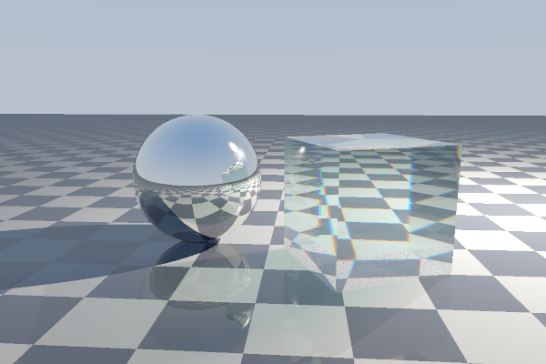
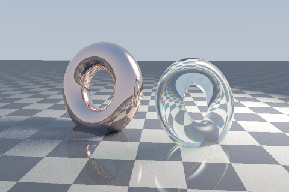

# pg_rt — a raytracer in PostgreSQL 17

A recursive raytracer that runs entirely inside PostgreSQL and returns a PNG as
a `bytea`. It renders arbitrary triangular meshes with selectable materials.
No extensions, no procedural language beyond the two that ship in core, no
external image library — the PNG container, its checksums, its scanline filters
and a complete DEFLATE codec in both directions are all built in SQL.

```sql
SELECT render(600, 400, 2, 5);                       -- trace into the table `img`
SELECT png_encode(600, 400, png_scanlines('img'));   -- -> bytea
```



A checkered ground plane, a metal sphere and a glass cube — all three are
triangle meshes, and the tracer does not know which is which.

## Running it

```bash
docker compose up -d      # PostgreSQL 17
./load.sh                 # install the engine and build the default scene
./test.sh                 # 147 checks on the codec, the geometry and the optics
./render.sh 600 400 2 5   # width height samples-per-axis max-depth -> out.png
```

## Geometry lives in tables

A scene is rows. Meshes hold triangles, triangles carry optional vertex
normals, and each mesh points at a material:

```sql
SELECT mesh_add_sphere('ball', 'chrome', 1.0, ROW(-1.15, 1.0, -0.2)::vec3, 24);
SELECT mesh_load_obj('bunny', 'crown-glass', :'obj_text',
                     0.9, radians(30), ROW(1.4, 0.9, 0.6)::vec3);
SELECT scene_reindex();          -- rebuild the BVH after any change
```

Changing how something looks is an `UPDATE` of one foreign key — the geometry
is not touched:

```sql
SELECT mesh_set_material('ball', 'crown-glass');
```

Changing where something *is* is also an `UPDATE`, of one column:

```sql
SELECT mesh_place('block', m34_place(1.0, radians(30), ROW(1.35, 0, 0.55)::vec3));
```

That costs one row, and **no reindex** — `tri` and the BVH come out of an
animation byte for byte as they went in. The transform is applied to the
*ray*, carrying it into the mesh's own coordinates rather than carrying the
mesh into the world's, so nothing the acceleration structure describes can go
stale when a mesh moves. `examples/spin.sql` animates the default scene over
twelve frames and checks exactly that.

Two things this has to get right and does: the object-space ray direction is
deliberately left **unnormalised**, which is what keeps distances, shadow
lengths and glass thicknesses in world units across the seam; and normals are
carried by the **inverse transpose**, without which a non-uniformly scaled
surface gets normals that are no longer perpendicular to it. Both are pinned
by tests that were checked against a deliberately broken implementation.

A material is a row. `kind` selects the model (diffuse, metal, dielectric) and
the rest are its parameters, including a per-channel index of refraction, so a
second glass with a different dispersion is another `INSERT` rather than
another code path:

```sql
INSERT INTO material (name, kind, ior, absorb, spec_e)
VALUES ('flint-glass', mat_glass(),
        ROW(1.60, 1.68, 1.79)::vec3, ROW(0.20, 0.10, 0.12)::vec3, 420.0);
```

So is a light. A three-point setup is three rows, and nothing in the transport
code knows how many there are — it works on `(hit, light)` pairs and sums them:

```sql
INSERT INTO light (name, p, col, pow) VALUES
  ('fill', ROW(-4.8, 2.6,  5.2)::vec3, ROW(0.42, 0.55, 1.00)::vec3, 55.0),
  ('rim',  ROW(-2.2, 3.4, -6.5)::vec3, ROW(1.00, 0.55, 0.30)::vec3, 90.0);
```

`sky_k` gives a light a disc in the sky, so it shows up in a mirror and in the
background as well as on the surfaces it lights. Keeping that on the light
rather than in the sky is what holds the two consistent: move the light and its
reflection moves with it.

## Renders are rows too

`render()` fills `img`, a scratch table that the next render replaces. A
`frame` row is the durable version: the settings, the camera, and the encoded
PNG together, so the database records what a picture is *of* rather than only
what it looks like.

```sql
INSERT INTO frame (name, w, h, aa, maxdepth) VALUES ('hero', 600, 400, 2, 5);
SELECT render_frame('hero');
SELECT name, w, h, elapsed_ms, length(png) FROM frame;
```

The camera lives on the frame rather than on the scene, because a camera is a
property of a *view* of a scene — so a hundred viewpoints are a hundred rows
against one set of geometry, and a camera path is a query:

```sql
INSERT INTO frame (name, w, h, cam_from)
SELECT format('orbit-%s', i), 480, 320,
       v3(6.7 * cos(radians(i * 6)), 2.35, 6.7 * sin(radians(i * 6)))
FROM generate_series(0, 59) i;

SELECT render_frame(frame_id) FROM frame WHERE png IS NULL ORDER BY frame_id;
```

Moving the camera touches no geometry at all — `tri` and the BVH are untouched
between frames and nothing is reindexed — so this is the one animation that
costs nothing beyond the frames themselves. Resuming an interrupted sequence is
`WHERE png IS NULL`, which is also why the rows are inserted before anything is
traced: the sequence is data, and rendering it is a separate step.
`examples/orbit.sql` is that, end to end, against whatever scene is loaded.

Because the backlog is a table, several sessions can work through it at once:

```bash
./render_frames.sh 8      # eight sessions against `frame WHERE png IS NULL`
```

`render_next_frame()` claims one row with `FOR UPDATE SKIP LOCKED`, so sessions
take disjoint frames with no coordination and no work list anywhere — sessions
can be added or killed mid-run, and one that dies puts its frame straight back
in the queue. The orbit above is 24 frames: 144 s one at a time, **37 s at
eight**, byte-identical either way.

The driver is a shell script because it has to be. Nothing in core PostgreSQL
starts a background job, and `dblink` and `pg_background` are extensions.

The row stores the PNG rather than the pixels. `img` holds 8-bit values that
already went through exposure, the tone curve, gamma and clipping, so keeping
them would not be a cheaper route back to a differently exposed image than
re-tracing is — only a much larger one: roughly 100 MB of rows against 419 kB
of `bytea` for a full HD frame.

`examples/torus_scene.sql` builds a scene from `examples/torus.obj` — two
copies of one OBJ at different sizes and angles, wearing different materials:



The same scene at 1920x1080 is
[`examples/torus_fullhd.png`](examples/torus_fullhd.png). It is 604 kB, and it
was 6.2 MB until the encoder could compress — the file in the repository is
that same image put back through `inflate` and re-encoded, not re-rendered, so
its pixels are the ones the tracer produced.

The OBJ reader handles `v`, `vn` and `f`, polygons of any size
(fan-triangulated), all of the `1`, `1/2`, `1//3` and `1/2/3` corner
spellings, and negative (relative) indices. A mesh loaded without normals can
be smoothed after the fact with `mesh_smooth()`, which averages the facet
normals meeting each vertex, weighted by area.

## What it renders

* **Diffuse** — Lambertian under every light in the scene, with an optional
  procedural checker and a Fresnel-weighted specular reflection on top.
* **Metal** — a conductor, so no diffuse lobe at all: lit entirely by what its
  mirror ray finds, tinted per channel by a Fresnel term whose
  normal-incidence value *is* the metal's colour.
* **Dielectric** — Snell refraction, Schlick–Fresnel reflection, total internal
  reflection past the critical angle, and Beer–Lambert absorption over the true
  path length through the medium.

### Dispersion

A dielectric's index of refraction differs per channel (1.470 / 1.530 / 1.605
for the default glass), so white light entering it splits. A ray carries a
`chan` tag: `0` means it still stands for all three wavelengths, `1`–`3` mean
it has been committed to one. At the first glass surface an undispersed ray
spawns *three* refracted children, each masked down to its own channel and
bent by its own index; from then on each follows a measurably different path.
At 45° incidence red and blue separate by 2.6°, which is what puts the coloured
fringes along the glass edges.

Shadow rays are attenuated rather than binary, so glass casts a tinted shadow
whose colour comes from Beer–Lambert absorption over the thickness the ray
actually traverses.

## How it works

### One set-based pass per bounce

There is no per-pixel loop. Every ray alive at a given bounce depth is
intersected by a *single* query: a join from the ray set through the mesh
boxes, through the BVH leaves, down to the triangles, reduced to one nearest
hit per ray by a hash aggregate.

```sql
SELECT r.rid, nearest(ROW(x.t, t.tri_id)::cand)
FROM rt_ray r
     JOIN mesh_box mb ON box_hit(r.o, r.iv, mb.lo, mb.hi)
     JOIN bvh_node n  ON n.mesh_id = mb.mesh_id AND box_hit(r.o, r.iv, n.lo, n.hi)
     JOIN tri t       ON t.cl = n.cl
     CROSS JOIN LATERAL (SELECT tri_hit(r.o, r.d, t.a, t.b, t.c) OFFSET 0) AS x(t)
WHERE x.t IS NOT NULL
GROUP BY r.rid;
```

`nearest` is a custom aggregate that keeps the smallest `t`. Reducing millions
of candidates with `DISTINCT ON` would mean sorting all of them; an aggregate
does it in one hash pass, and a combine function makes it parallel-safe.

**This used to be one recursive CTE, and it cannot stay that way.** A
set-based intersection has to aggregate many candidate triangles down to one
nearest hit, and PostgreSQL forbids aggregates in a recursive term:

```
ERROR:  aggregate functions are not allowed in a recursive query's recursive term
```

So the recursion is unrolled by one level into a bounce loop, and the work
inside each iteration becomes an ordinary aggregating join. The loop is
bounded by `maxdepth` and exits early when no rays survive the throughput
cutoff.

### Three levels of bounding volume, one join each

The mesh box rejects whole objects, the BVH leaf rejects clusters of triangles,
the triangle's own box rejects the triangle, and only what survives all three
reaches Möller–Trumbore. Leaves are runs of Morton-ordered triangles, which
keeps them spatially compact. `scene_reindex()` rebuilds all of it and must be
called after any change to geometry.

The tree is two built levels deep because the number of join levels has to be
written into the query text — see [`research/bvh.md`](research/bvh.md) for the
leaf-size measurements and the third level that was built and rejected.

### Leaf math is written to be inlined

PostgreSQL inlines a SQL function whose body is a single `SELECT` with no
`FROM`, substituting it into the caller's expression tree so that no call
happens at runtime. Essentially every performance decision in the engine
follows from that, including some that look strange in isolation: the `OFFSET
0` fences on the LATERAL joins, the flat `float8` mirror columns beside every
stored `vec3`, and the split between what is written in SQL and what is written
in PL/pgSQL.

It is worth reading [`research/inlining.md`](research/inlining.md) before
changing any of it, because inlining fails **silently** — same plan, same row
counts, only a slower clock.

### The PNG is built byte by byte in SQL

PostgreSQL exposes no zlib binding to SQL, so the container *and the codec* are
assembled from scratch:

* **CRC-32** for the chunk trailers, from a 256-entry table generated at
  install time by a recursive CTE.
* **Adler-32** for the zlib trailer. It is a running sum plus a running sum of
  that sum, so it closes into a form with no loop at all —
  `a = 1 + Σb[j]`, `b = n + Σb[j]·(n−j+1)` — evaluated as one aggregate.
* **DEFLATE**, really: LZ77 matching over a hash chain, Huffman code
  construction, and a bit stream. Every block is costed three ways — stored,
  fixed Huffman, dynamic Huffman — and the cheapest is the one written, so
  incompressible input is never inflated and a flat image collapses.
* **INFLATE**, so a PNG can be read as well as written. Nothing renders with
  it; it is what a texture would arrive through, and it is what lets the test
  suite ask whether a PNG is *right* rather than only how long it is.
* **The five PNG filters.** They compress nothing on their own — each is a
  reversible prediction from neighbours already sent — but they turn a smooth
  gradient into a heap of near-zero residuals, which is what gives DEFLATE
  something skewed enough to code.

A 480×320 frame that was 461 kB of stored blocks is **82 kB**, and the whole
encode is about 1% of the render that produced it. Sizes land within a couple
of percent of zlib's on the same input, occasionally under it — the block
chooser costs all three candidates exactly, where a streaming encoder has to
decide before it has seen the block.

The filter is chosen by compressing, not by predicting, and that is a departure
worth flagging. Every PNG encoder picks per scanline using the sum of absolute
residuals; measured against actually trying each option, that heuristic is
beaten by a plain fixed filter at every resolution tested, by 5–13%. It ranks
badly because it measures residual *magnitude* where DEFLATE pays for
*repetition* — at 480×320 it puts Paeth first and None last by a factor of 44,
when Sub is smallest and None beats three of the five.
[`research/deflate.md`](research/deflate.md) has the tables.

The codec is verified against streams a real zlib produced, in both directions,
because a compressor and a decompressor that share an author will happily agree
on the same mistake.

## Performance

A 240×160 frame with 2×2 samples and depth 5 renders the default 1118-triangle
scene in about 15 s on a laptop in Docker; full HD at one sample takes about
4½ minutes. Absolute numbers travel badly — the same binary measured 1.9×
faster on the same machine after a power-profile change — so the write-ups
below deal in ratios, measured back-to-back. Most of them contradicted the
obvious approach, which is why they are recorded rather than rediscovered:

| | |
|---|---|
| [`research/inlining.md`](research/inlining.md) | The rule the whole engine rests on, and how to audit it when it silently stops applying |
| [`research/query-shape.md`](research/query-shape.md) | Joins against loops, CTAS against INSERT, and why JIT is off |
| [`research/bvh.md`](research/bvh.md) | Leaf sizing, the triangle box, and the level that was rejected |
| [`research/deflate.md`](research/deflate.md) | Where the bytes live, why the block chooser has to cost the whole block, and what the filters are worth |
| [`research/timings.md`](research/timings.md) | Per-phase and per-resolution breakdowns, and what a full HD frame costs in bytes |

`render(..., p_verbose => true)` reports each phase as it goes, which is the
quickest way to see where a particular scene is spending its time.

Two settings are worth knowing about because they are not defaults: `jit` is
**off** (it measured 3× slower here), and `docker-compose.yml` raises `work_mem`
because each bounce is one large set-oriented join.

A single render is single-threaded, deliberately. The scratch tables are
`TEMP`, which is what lets sessions render at once, and PostgreSQL will not
parallelise a query that reads a temporary table. That costs 9%, because
writes are never parallel in PostgreSQL and so only the `CREATE TABLE AS` ray
builds ever had a Gather to lose — against 4× for running eight renders at
once.

## Layout

| file | contents |
|---|---|
| `sql/01_vec3.sql` | `vec3` type, operators, reflection and Snell refraction |
| `sql/02_deflate.sql` | Adler-32, LZ77, Huffman, DEFLATE and INFLATE |
| `sql/02_png.sql` | CRC-32, the five scanline filters, PNG chunk framing |
| `sql/03_mesh.sql` | mesh/material/triangle tables, transforms, intersection, BVH, OBJ loader |
| `sql/04_scene.sql` | the light table, sky, the default scene |
| `sql/05_trace.sql` | Fresnel, absorption, direct lighting, ray spawning |
| `sql/06_render.sql` | camera, tone mapping, the bounce loop |
| `sql/07_frame.sql` | the frame table, the render that stores its result, the queue |
| `test/tests.sql` | 147 checks |
| `examples/` | a torus OBJ, the scene that loads it, a camera orbit, a moving scene |
| [`research/`](research) | the measurements behind the design |

## Notes and limitations

* The BVH is two levels deep because the number of join levels has to be
  written into the query text. A tree of arbitrary depth would need a
  recursive descent per bounce, which is expressible now that the bounce loop
  is no longer itself a recursive CTE — it is the obvious next step, and it is
  what a scene of 100k triangles would need.
* `scene_reindex()` must be called after changing geometry. New triangles have
  no BVH leaf until it runs, and the renderer will not see them.
* Vertex *baking* is still scale, pitch and yaw only, so building a sheared
  mesh needs `mesh.xform` rather than `mesh_load_obj`'s arguments. The
  transform itself is a general affine map and handles both.
* A frame records the camera it was taken from but not the scene it was
  pointed at, so a **geometry** animation cannot be queued the way a camera
  move can. It has to interleave the `UPDATE` with the render, which means one
  session and strict order — `examples/spin.sql` does not use
  `render_frames.sh`, while `examples/orbit.sql` can, and pays about 4× in wall
  clock for it.

  Worth knowing precisely, because the failure is not just "the wrong pose":
  `render()` is a `VOLATILE` function and each statement in it takes a fresh
  snapshot under `READ COMMITTED`, so a pose committed by another session
  part-way through is visible to *later bounces of a render already running*.
  Measured directly: two reads of `mesh.xform` in one function call returned
  0 and then 99. A frame can therefore come out internally inconsistent —
  primary hits against one pose, reflections against another — rather than
  merely stale. A caller that must do both at once should take its snapshot
  explicitly with `BEGIN ISOLATION LEVEL REPEATABLE READ`.
* Lights are points, so shadows are hard-edged. An area light is several rows
  sampling one emitter — the renderer already sums them and needs no change —
  but placing those samples well needs a PRNG, and `random()` is `VOLATILE` and
  would break the planner's assumptions, so it would have to be a hash of the
  ray index.
* A light costs one shadow ray per hit it can reach, so render time is linear
  in the light count — but only in the shadow pass, not in shading. Numbers in
  [`research/timings.md`](research/timings.md).
* The ground plane's Fresnel reflectance is capped below its physical value.
  Uncapped, a grazing-angle mirror floor reflects the bright uniform sky
  across the whole lower frame and erases its own shadows.
* Glass shows some speckle at one sample per pixel: three refracted channels
  each take a different path, and where one of them hits a checker edge the
  disagreement shows up as a coloured pixel. More samples per pixel resolve it.
